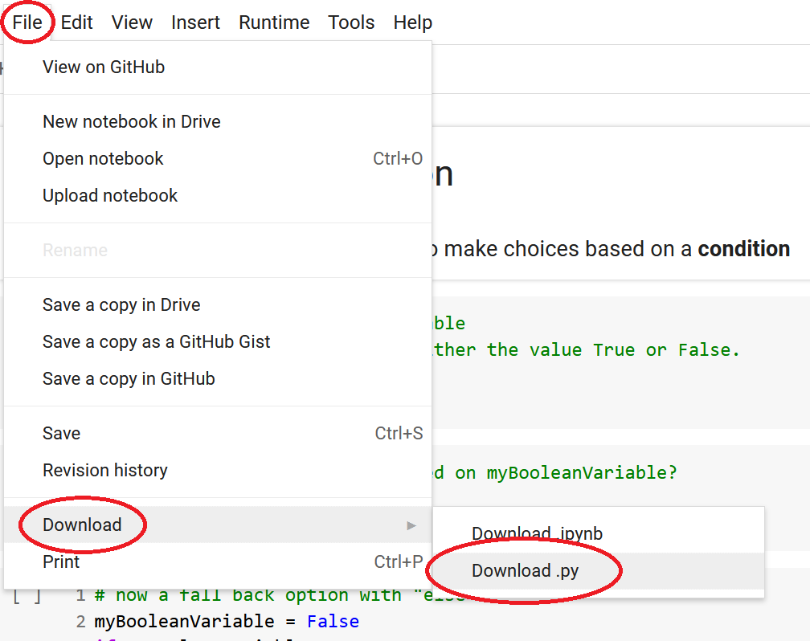
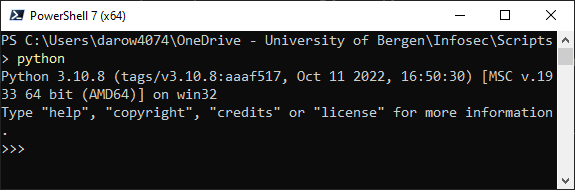

# Using your Jupyter notebook elsewhere

Jupyter notebooks are great for developing software and for running it interactively.

Python is capable of a lot more than this so there will be times where you'll want to run it as a script and just see the output without the interactive features of Jupyter.

In this case we want to Download the script as a `.py` file (this may also be called "Export" or "Save as" if you're using something other than Colab)

You then have your notebook as a script that can be run on your local computer (if you have Python installed) or any other computer where Python is installed.

## Is python installed?

To find out if Python is installed on a computer, the easiest way is to try and start it.

Open a command prompt or terminal and then simply type either `python` or `python3`. 

If you see a screen with a prompt like this `>>>`, you have Python installed

To get out of the Python *interpreter* you need to issue the command `exit()`.

## Now run the script

If you have Python installed you simply issue the command `python <scriptFileName>` (or `python3` if that's the name for Python on your computer)

Let's [try it out](http://colab.research.google.com/github/dfbr/pythonLessons/blob/main/Notebooks/exportScript.ipynb)

## [Next lesson](complexExample.md)